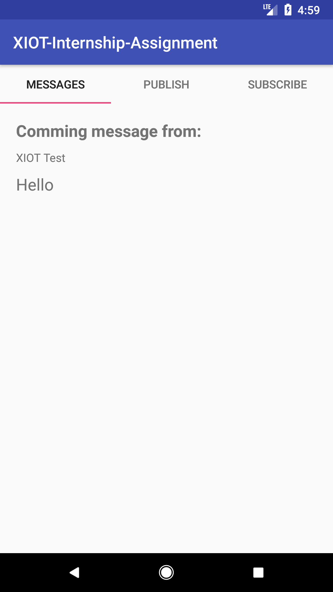

## MQTT-Service

# I Used Java to build this application as I have an experience with this language about 1+ year.

# What I want from this application:

I build this application to test the MQTT connectivity service.
and here how I build it:

1- Learnt the concept of MQTT service.
2- Desinged my app and how it flow is.
3- Built the classes the present the flow and service.
4- Tested my app in local with [MQTTBox desktop app].

Also, I have [about 1 year] experience with android.

{:height="50%" width="50%"}

