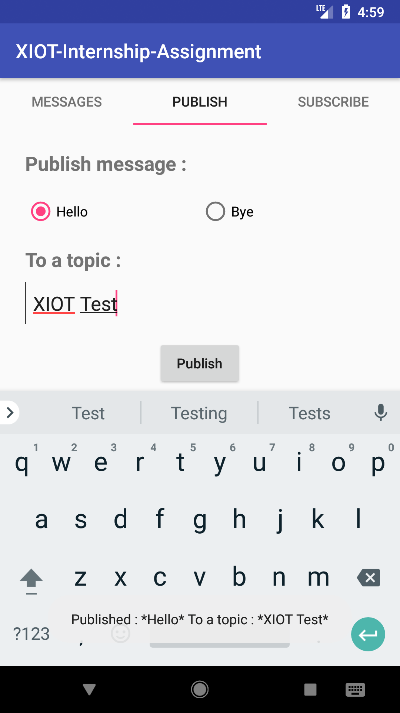

## MQTT-Service

# What I used:
I Used Java to build this application as I have an experience with this language about 1+ year.

# What I want from this application:

I build this application to test the MQTT connectivity service.
and here how I build it:

- Learnt the concept of MQTT service.
- Desinged my app and how it flow is.
- Built the classes the present the flow and service.
- Tested my app in local with [MQTTBox desktop app].

Also, I have [about 1 year] experience with android.

# What I learnt from this application process:
- How to use the MQtt service as this is my first time to work with this API.

# Screen shots

.

.

.

.

